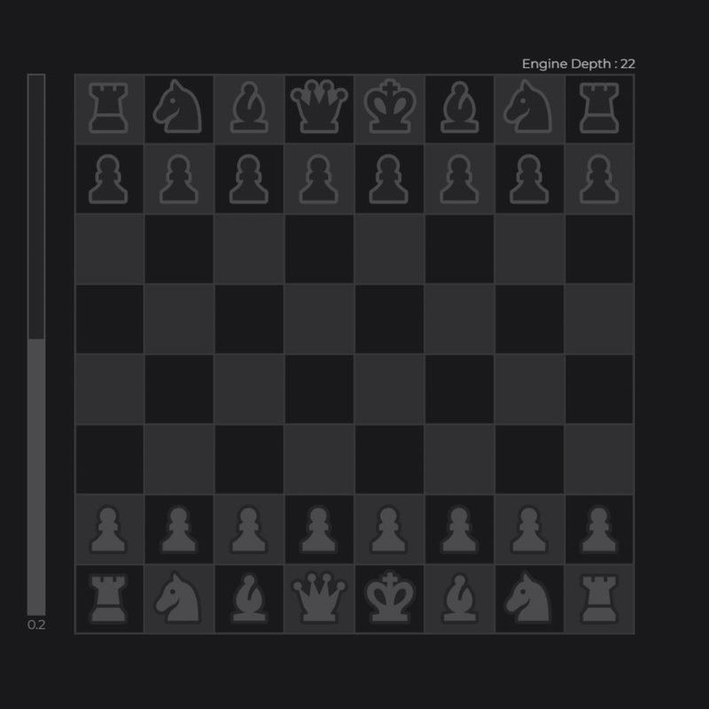

[](https://chess.jpbhatt.tech/)  
# Cengine  

### A lightweight chess application that lets you play with a friend, face off against the Stockfish engine, or receive real-time move suggestions.

#### Try cengine [here](https://chess.jpbhatt.tech/).

## Features
- Two players on the same device take turns on a local board. 
- Challenge the world’s strongest open-source engine.
- Toggle hints to see the engine’s best-move recommendations in real time. 
- Engine position analysis
- Move history and undo functionality

## Installation
1. Clone the repo:  
   ```bash
   git clone https://github.com/jpbhatt21/cengine.git
   cd cengine
   ```
2. Install dependencies:  
   ```bash
   npm install
   ```
3. Start the app:
   ```bash
   npm run dev
   ```

## Usage
```bash
npm run dev
```

## Configuration
Toggle for the following settings:  
- `1`: toggle white user input
- `2`: toggle white move suggestions
- `3`: toggle white engine automove
- `q`: toggle black user input
- `w`: toggle black move suggestions
- `e`: toggle black engine automove
- `left arrow`: move undo
- `right arrow`: move redo

## Demo

## License
Distributed under the MIT License.

